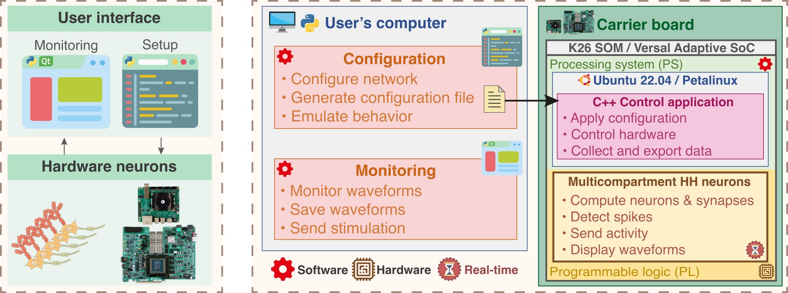

# BiœmuM: Biomimetic Emulation of multicompartments neurons

## Overview

BiœmuM is a biomimetic real-time Spiking Neural Network (SNN) emulating multicompartment Hodgkin & Huxley neurons.

_Maintainers_: Timothée Lévi (timothee.levi@u-bordeaux.fr)

_Authors_: Romain Beaubois (refbeaubois@yahoo.com), Jérémy Cheslet (jeremy.cheslet@u-bordeaux.fr)

## Features

| Features          | Details       |
|-------------------|---------------|
| **Neuron types**  | FS, RS, LTS, IB and more (6 conductance-based currents) |
| **Synapse types** | AMPA, NMDA, GABAa, GABAb |
| **Max neurons/segments**   | 16/64 (KR260) <br> 16/96 (VPK120) |
| **Max synapses**  | 1,048,576 |
| **Targets**       | KR260, VPK120 |
| **Support OS**    | Ubuntu 20.04/22.04 (KR260) <br> Petalinux (KR260, VPK120) |
| **Setup**         | Configuration file + AXI-Lite |
| **Spikes monitoring** | Disabled |
| **Waves monitoring**  | On-board file saving (DMA) <br> ZeroMQ forwarding (DMA) <br> DAC (PMOD DA4)|

## System architecture

### Overview of the system architecture


### Overview of the configuration architecture


### Monitoring channels


## Repository structure

* **docs** : documentation, figures and changelogs
* **sw** : software sources
  * **host**: configuration, emulation and monitoring scripts
  * **target**: C++ application, firmware, drivers and scripts for target

## Documentation

Documentation is provided in ```docs/```.
* [Get started with Ubuntu (Kria only)](docs/GET_STARTED_KRIA_UBUNTU.md)
* [Get started with PetaLinux](docs/GET_STARTED_PLINUX.md)
* [Create custom network configurations](docs/config/gen_netw_conf.md)

## Changelog

Changelogs are provided in ```docs/```.
* [Hardware Changelog](docs/HW_CHANGELOG.md): changes to the hardware design (HDL/HLS Programmable Logic)
* [Software Changelog](docs/SW_CHANGELOG.md): changes to the software design (C++ control application and Python configuration scripts)

## Issues and Contributing

In case you find any issues that have not been reported yet, don't hesitate to open a new issue here on Github or consider contacting the maintainers.

## Licensing

This project is licensed under GPLv3.

```SPDX-License-Identifier: GPL-3.0-or-later```

## Publication

**"Real-time multicompartment Hodgkin-Huxley neuron emulation on SoC FPGA"**

Romain Beaubois, Jérémy Cheslet, Yoshiho Ikeuchi, Pascal Branchereau, Timothée Levi

Frontiers in Neurosciences - Oct 2024

doi: <>

## Acknowledgement

AMD for the donation through the AMD University Donation Program of software licenses and Versal Premium Series VPK120 Evaluation Kit used to develop this project.