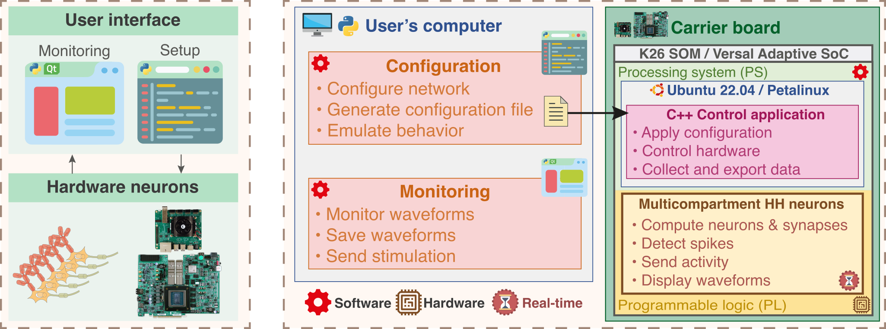
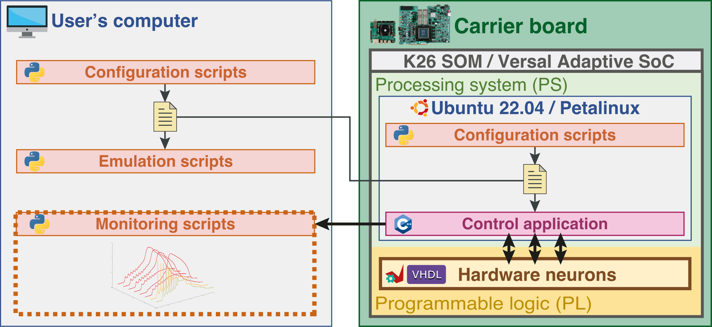
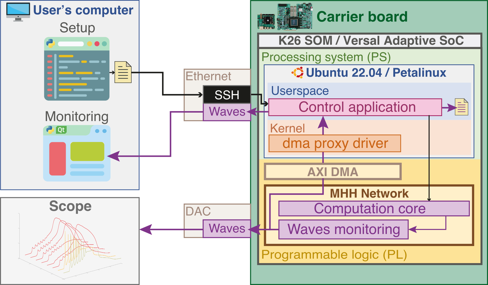

# Get Started for PetaLinux

## Overview

**Overview of the system architecture**


**Network configuration file**


**Monitoring channels**


| OS                | Supported version |
| - | - |
| **PetaLinux**     | 2023.2 (KR260:airplane:, VPK120:rocket:) |

> Board/architecture will be illustrated as below (mnemonic)
> :airplane: Kria  (fast, convenient, affordable)
> :rocket: Versal (faster, powerful, bulky, expensive)

## Creating PetaLinux image from scratch

* Export Hardware from Vivado 
  * :rocket: append `_pld` to file name .xsa when exporting
* Set petalinux environment
```bash
source <plinux_tools_paths>/settings.sh
```
* Create the petalinux project
```bash
# <path_to_bsp>: petalinux bsp downloaded from AMD website
# <board_id>: board identifier (kr260, vpk120)
# <path_to_xsa>: path to hardware file (/sw/plinux/apps/*.xsa)
petalinux-create -t project -s <path_to_bsp> -n plinux-<board_id>
cd plinux-<board_id>
petalinux-config --get-hw-description <path_to_xsa>
```

* Configure PetaLinux image
```bash
petalinux-config
```

```bash
Image Packaging Configuration --> Root Filesystem Type --> [*] EXT4 (SD/eMMC/SATA/USB)
Image Packaging Configuration --> (/dev/mmcblk0p2) Device node of SD device
Image Packaging Configuration --> [] Copy final images to tftpboot
```

* Add dma proxy driver
```bash
petalinux-create -t modules --name dma-proxy --enable
cp /sw/plinux/modules/dma_proxy/dma-proxy.c \ 
/sw/linux/plinux-<board_id>/project-spec/meta-user/recipes-modules/dma-proxy/files/dma-proxy.c
```

* Configure rootfs from user config (`<petalinux_prj_dir>/project-spec/meta-user/conf/user-rootfsconfig`)
```bash
#File: <petalinux_prj_dir>/project-spec/meta-user/conf/user-rootfsconfig
# User drivers
CONFIG_dma-proxy # should be already included 
# Essentials
CONFIG_xrt
CONFIG_xrt-dev
CONFIG_dnf
CONFIG_zocl
CONFIG_git
CONFIG_bootgen
CONFIG_bootgen-dev
CONFIG_packagegroup-petalinux-self-hosted
CONFIG_packagegroup-core-buildessential
CONFIG_packagegroup-core-buildessential-dev
CONFIG_imagefeature-package-management
CONFIG_imagefeature-serial-autologin-root
CONFIG_make
CONFIG_python3-numpy
# Additional
CONFIG_ethtool
CONFIG_wget
CONFIG_gzip
CONFIG_vim
CONFIG_vim-syntax
CONFIG_man
CONFIG_man-pages
CONFIG_perl
CONFIG_automake
CONFIG_cpufrequtils
```

```Bash
petalinux-config -c rootfs
```
* Configure kernel
```bash
petalinux-config -c kernel
```

```bash
General setup --> Preemption Model --> (X) Preemptible Kernel (Low-Latency Desktop)
```
* Build petalinux
```bash
petalinux-build
```

* Package image
:airplane: ```petalinux-package --boot --format BIN --fsbl images/linux/zynqmp_fsbl.elf --u-boot```
:rocket: ```petalinux-package --boot --format BIN --plm --psmfw --u-boot --dtb```

* Prepare SD
	* Create boot partition
	  * Name: PLX-BOOT
	  * File system: FAT32
	  * minimum 500 MB
	  * ideally 4 MB aligned

	* Create root partition
	  * Name: PLX-ROOT
	  * File system: EXT4

* Flash SD boot
```bash
# /mnt/ or path other mounting  path
sudo cp -r images/linux/BOOT.BIN /mnt/PLX-BOOT
sudo cp -r images/linux/boot.scr /mnt/PLX-BOOT
sudo cp -r images/linux/image.ub /mnt/PLX-BOOT
sudo umount /mnt/PLX-BOOT
```

* Flash SD root
```bash
sudo tar xvfp images/linux/rootfs.tar.gz  -C /mnt/PLX-ROOT
sudo umount /mnt/PLX-ROOT
```

* Login to the board through serial port (minicom, putty, mobaxterm)

``` Bash
# Default
login: petalinux
password: root
```

* Setup internet access
  <details>
  <summary>(1) Connected to local network</summary>
  
  * Connect Ethernet cable to the local network.
  </details>
  
  <details>
  <summary>(2) Shared over Ethernet</summary>
    
  * **Windows**: ⊞+R > control > Network & Internet > Center Network and share > (on side window) Modify board settings > (on your board connected to internet) right click > Properties > (Tab) Sharing > (Tick) authorize sharing > select board connected to the target Ethernet
    
  * **Linux** (Gnome): Network manager > Wired connection > Shared to other computers
  </details>

* Get the IP assigned to the board using ```ifconfig``` command (inet value of eth0, here 10.42.0.16)

``` Bash
plinux-vpk120:~/bioemum$ ifconfig
eth0      Link encap:Ethernet  HWaddr EA:9E:A8:5D:49:B2  
          inet addr:10.42.0.16  Bcast:10.42.0.255  Mask:255.255.255.0
          inet6 addr: fe80::e89e:a8ff:fe5d:49b2/64 Scope:Link
          UP BROADCAST RUNNING MULTICAST  MTU:1500  Metric:1
          RX packets:32373 errors:0 dropped:0 overruns:0 frame:0
          TX packets:14686 errors:0 dropped:0 overruns:0 carrier:0
          collisions:0 txqueuelen:1000 
          RX bytes:29157739 (27.8 MiB)  TX bytes:2422552 (2.3 MiB)
          Interrupt:29 
```

> :airplane: **eth0**: bottom PS Ethernet port, **eth1**: top PS Ethernet port
> :rocket: **eth0**: ethernet port close to the SD card

* Start SSH session at the IP address (MobaXterm, or console if Linux)

```Bash
# MobaXterm
Remote host: 10.42.0.16
Username: petalinux
Port: 22
# Linux
ssh petalinux@10.42.0.16
```

* Install pacakges
```bash
sudo dnf install htop zeromq-dev
```

## Setup BioemuM

This procedure "installs" BioemuM on the board by building the different requirements for BioemuM to run.

* Copy ```sw/target``` on the board at ```~/``` or ```/home/ubuntu``` (i.e. using SFTP with MobaXterm, USB drive, ...) or clone from github.
```Bash
# cloning from github
git clone https://github.com/Ceramic-Blue-Tim/bioemum.git gitbioemum
cp -r gitbioemum/sw/target/bioemum bioemum
```
* Rename folder to ```bioemum```
```Bash
# if not cloned from github
mv target bioemum
```
* Run initialization depending on target (kr260 or vpk120):

```Bash
# <board_id>: board identifier (kr260, vpk120)
cd bioemum
chmod +x init.sh
source ./init.sh <board_id>
```

> In case of scripts not running, try converting all .sh to unix format using `dos2unix` (`sudo dnf install dos2unix` then `dos2unix *.sh`)

* Build all recipes (software: C++ application, firmware: device tree and bitstream platform, drivers: DMA proxy driver)

```Bash
./build.sh
```

> The different depedencies can be build independently by passing the arguments ```software|firmware|drivers```.

> `firmware/build.sh` allows so select whether to build firmware from `firmware/boards` or use rootfs through the variable `ROOTFS_FIRMWARE_VERSAL` (default is false). When not using rootfs build, it uses the .pdi (:rocket:) / .bit (:airplane:) and .dtsi (with dma_proxy node).

## Run
* Run application
```bash
./launch_app.sh <path_to_swconfig_file_json>
```